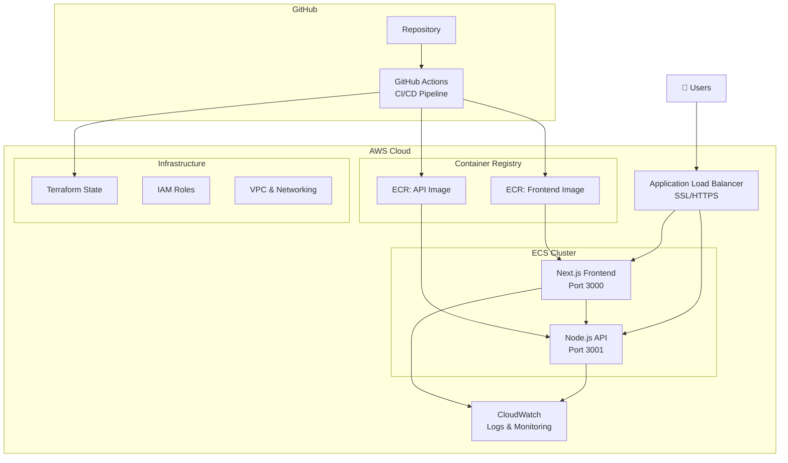

# 🚀 ECS Fullstack Application

<div align="center">


**A production-ready fullstack application deployed on AWS ECS with enterprise-grade features**

[🌐 Live Demo](#) • [📖 Documentation](#documentation) • [🚀 Quick Start](#quick-start) • [🏗️ Architecture](#architecture)

</div>

---

## ✨ Features

🔥 **Modern Tech Stack**
- **Backend**: Node.js + Express.js API
- **Frontend**: Next.js + React SPA
- **Infrastructure**: Terraform IaC
- **Containerization**: Docker & Docker Compose
- **Cloud**: AWS ECS + ECR + ALB

🛡️ **Enterprise Security**
- SSL/HTTPS encryption
- CORS protection
- Non-root containers
- VPC network isolation
- IAM roles and policies

⚡ **Production Ready**
- Auto-scaling capabilities
- Health check monitoring
- Load balancer integration
- CloudWatch logging
- CI/CD pipeline with GitHub Actions

🎯 **Developer Experience**
- Hot reload development
- Multi-stage Docker builds
- Infrastructure as Code
- Automated deployments
- PR checks and validation

---

## 🏗️ Architecture



---

## 🚀 Quick Start

### Prerequisites
- Docker & Docker Compose
- AWS CLI configured
- Terraform (for infrastructure)
- Node.js 18+ (optional for local dev)

### 🐳 Local Development
```bash
# Clone the repository
git clone https://github.com/AKRAMSOUIDA/ECS_fullstack_app-.git
cd ECS_fullstack_app-

# Start all services
docker compose up --build

# 🎉 Access your applications
# Frontend: http://localhost:3000
# API: http://localhost:3001
```

### ☁️ AWS Deployment

#### Option 1: Terraform (Recommended)
```bash
# Navigate to Terraform directory
cd Terraform

# Initialize Terraform
terraform init

# Plan deployment
terraform plan

# Deploy infrastructure
terraform apply
```

#### Option 2: GitHub Actions CI/CD
1. Fork this repository
2. Set up AWS credentials in GitHub Secrets
3. Push to main branch - automatic deployment!

---

## 📁 Project Structure

```
ECS_fullstack_app-/
├── 🔧 api/                     # Node.js Express API
│   ├── server.js              # Main server application
│   ├── package.json           # Dependencies & scripts
│   └── Dockerfile             # Container configuration
├── 🎨 frontend/               # Next.js React App
│   ├── pages/                 # Application pages
│   ├── components/            # Reusable components
│   ├── public/                # Static assets
│   ├── package.json           # Dependencies & scripts
│   └── Dockerfile             # Container configuration
├── 🏗️ Terraform/              # Infrastructure as Code
│   ├── main.tf                # Main Terraform configuration
│   ├── modules/               # Reusable Terraform modules
│   │   ├── ecr/              # Container registry
│   │   ├── ecs/              # Container orchestration
│   │   └── alb/              # Load balancer
│   └── deploy.sh             # Deployment script
├── 🔄 .github/workflows/      # CI/CD Pipelines
│   ├── deploy.yml            # Deployment workflow
│   ├── terraform.yml         # Infrastructure workflow
│   └── pr-check.yml          # PR validation
├── 🐳 docker-compose.yml      # Local development
├── 📋 deployment-guide.md     # Deployment instructions
└── 📖 README.md              # You are here!
```

---

## 🔌 API Endpoints

### Health Check
```http
GET /health
```
```json
{
  "status": "OK",
  "timestamp": "2025-06-27T08:00:00.000Z"
}
```

### User Management
```http
GET /api/users          # Get all users
POST /api/users         # Create new user
```

**Example Response:**
```json
[
  {
    "id": 1,
    "name": "John Doe",
    "email": "john@example.com"
  }
]
```

---

## 🛠️ Technology Stack

<table>
<tr>
<td align="center" width="25%">

### 🔙 Backend
- **Runtime**: Node.js 18+
- **Framework**: Express.js
- **Features**: REST API, CORS, Health Checks
- **Container**: Alpine Linux

</td>
<td align="center" width="25%">

### 🎨 Frontend
- **Framework**: Next.js 14
- **Library**: React 18
- **Features**: SSR, API Routes, Responsive
- **Build**: Production optimized

</td>
<td align="center" width="25%">

### ☁️ Infrastructure
- **Compute**: AWS ECS Fargate
- **Registry**: Amazon ECR
- **Load Balancer**: Application LB
- **IaC**: Terraform
- **Monitoring**: CloudWatch

</td>
<td align="center" width="25%">

### 🔄 DevOps
- **CI/CD**: GitHub Actions
- **Container**: Docker
- **Orchestration**: Docker Compose
- **Automation**: Terraform

</td>
</tr>
</table>

---

## 🔧 Configuration

### Environment Variables

| Variable | Description | Default |
|----------|-------------|---------|
| `NODE_ENV` | Environment mode | `development` |
| `PORT` | Server port | `3001` |
| `NEXT_PUBLIC_API_URL` | API endpoint URL | `http://localhost:3001` |
| `AWS_REGION` | AWS deployment region | `us-east-1` |

### GitHub Secrets (for CI/CD)
| Secret | Description |
|--------|-------------|
| `AWS_ACCESS_KEY_ID` | AWS access key |
| `AWS_SECRET_ACCESS_KEY` | AWS secret key |
| `AWS_REGION` | AWS region |

---

## 📊 Performance & Monitoring

### 🎯 Optimizations
- **Container**: Multi-stage Docker builds
- **Frontend**: Static generation & code splitting
- **Caching**: Efficient Docker layer caching
- **Resources**: Proper CPU/memory limits
- **Auto-scaling**: Based on CPU/memory metrics

### 📈 Monitoring
- **Health Checks**: Container & application level
- **Logging**: Structured JSON logs to CloudWatch
- **Metrics**: CPU, memory, and custom metrics
- **Alerts**: Automated monitoring alerts
- **Dashboards**: CloudWatch dashboards

---

## 🚀 Deployment Options

<div align="center">

| Method | Use Case | Complexity | Features |
|--------|----------|------------|----------|
| **Terraform** | Production IaC | Medium | Full control, versioning |
| **GitHub Actions** | Automated CI/CD | Low | Auto-deployment |
| **Manual ECS** | Learning/Testing | High | Step-by-step control |

</div>

---

## 🛡️ Security Features

- 🔒 **SSL/HTTPS**: End-to-end encryption with ACM certificates
- 🌐 **CORS**: Proper cross-origin handling
- 🐳 **Container Security**: Non-root users, minimal images
- 🔐 **Environment Variables**: Secure config management
- 🏠 **VPC**: Isolated network environment
- 👤 **IAM**: Least privilege access policies
- ↩️ **HTTP Redirect**: Automatic HTTPS redirect
- 🔍 **Security Groups**: Network-level firewall rules

---

## 🔄 CI/CD Pipeline

### GitHub Actions Workflows

1. **PR Checks** (`pr-check.yml`)
   - Code linting and testing
   - Docker build validation
   - Security scanning

2. **Terraform** (`terraform.yml`)
   - Infrastructure validation
   - Plan and apply changes
   - State management

3. **Deployment** (`deploy.yml`)
   - Build and push Docker images
   - Deploy to ECS
   - Health check validation

---

## 📚 Documentation

- 📖 [Deployment Guide](./deployment-guide.md)
- 🏗️ [Terraform Documentation](./Terraform/README.md)
- 🔧 [Terraform Structure](./Terraform/TERRAFORM_STRUCTURE.md)
- 🔄 [GitHub Actions Setup](./.github/README.md)
- 🔐 [Secrets Configuration](./.github/SECRETS_SETUP.md)

---

## 🤝 Contributing

We welcome contributions! Here's how to get started:

1. 🍴 Fork the repository
2. 🌿 Create a feature branch (`git checkout -b feature/amazing-feature`)
3. 💻 Make your changes
4. 🧪 Test locally with `docker compose up`
5. 📝 Commit your changes (`git commit -m 'Add amazing feature'`)
6. 🚀 Push to the branch (`git push origin feature/amazing-feature`)
7. 🎯 Open a Pull Request

### Development Guidelines
- Follow existing code style
- Add tests for new features
- Update documentation as needed
- Ensure Docker builds pass
- Test infrastructure changes

---

## 🎯 Roadmap

- [ ] Add database integration (RDS)
- [ ] Implement authentication (Cognito)
- [ ] Add monitoring dashboards
- [ ] Multi-environment support
- [ ] Blue/Green deployments
- [ ] Cost optimization features

---

## 📄 License

This project is licensed under the MIT License - see the [LICENSE](LICENSE) file for details.

---

## 🙏 Acknowledgments

- Built with ❤️ using AWS services
- Powered by modern web technologies
- Inspired by cloud-native best practices
- Community-driven development

---

<div align="center">

**⭐ Star this repo if you found it helpful!**

Made with ❤️ by [AKRAM SOUIDA](https://github.com/AKRAMSOUIDA)

[🔝 Back to top](#-ecs-fullstack-application)

</div>
